# EdTech Assistant Front End

# Introduction

EdTech Assistant is a platform designed to make teaching easier and more engaging for both educators and students. This app uses modern technology to help teachers manage their classrooms and deliver lessons more effectively. With features that support different parts of the teaching process, EdTech Assistant aims to improve the way education is delivered, allowing teachers to focus on teaching.

This repository contains the front-end part of the EdTech Assistant project, which includes all the code for the user interface and the parts of the app that users interact with.

# Getting Started

This project is built using Next.js. To get started with running the project locally:

1. In the root folder of the project, you’ll find a file named `.env.example`. Copy this file and rename it to `.env`.
2. Install all the necessary dependencies by running the following command:

```bash
yarn add
```

1. Start the development server using:

```bash
yarn run dev
```

or, if you prefer using npm

```bash
npm run dev
```

# Features Overview

## Login/ Sign-Up

### Sign-Up

The application provides a way to register a new account and activate the account through email

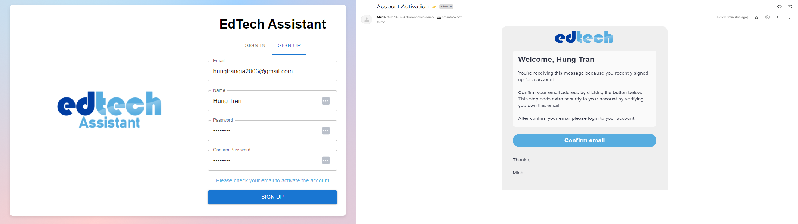

after clicking the email the user will be navigated to this page

<p align="center">
  
</p>

### Login

Login will be done with the email and password set up before.

<p align="center">
  
</p>

## Chat Application

### Search Web

After logging in, the user is directed to the chat page. The chat application is highly effective because it provides real-time data retrieval, allowing users to search and access the most current information. Below is a demonstration showcasing this functionality.

<p align="center">
  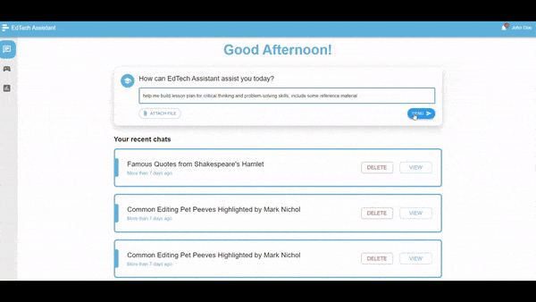
</p>

### Suggestion

The chat application is enriched with a comprehensive knowledge base focused on the education domain. To help users maximise its potential, we have included a button that lists all available suggestions and knowledge areas. Users can select these as a reference to fully leverage the chat application's capabilities.

<p align="center">
  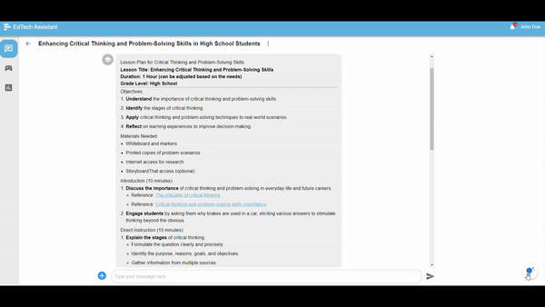
</p>

### File Handling

The chat application also supports PDF file handling, allowing users to upload a file and provide responses or answers based on its content.

<p align="center">
  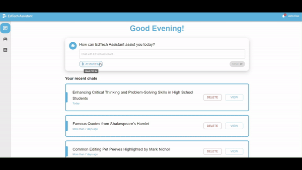
</p>

files can also be uploaded inside the chat itself

<p align="center">
  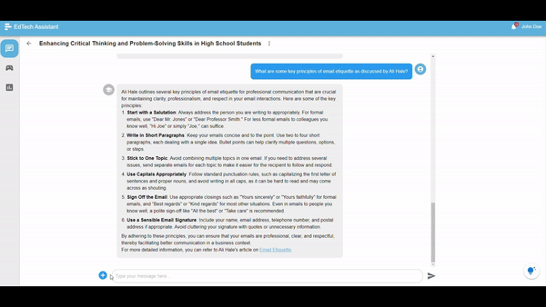
</p>

### Question Follow-Up

Our chat application supports follow-up questions by maintaining a conversation history, enabling the model to reference previous messages and provide context-aware responses within the same chat.

<!-- 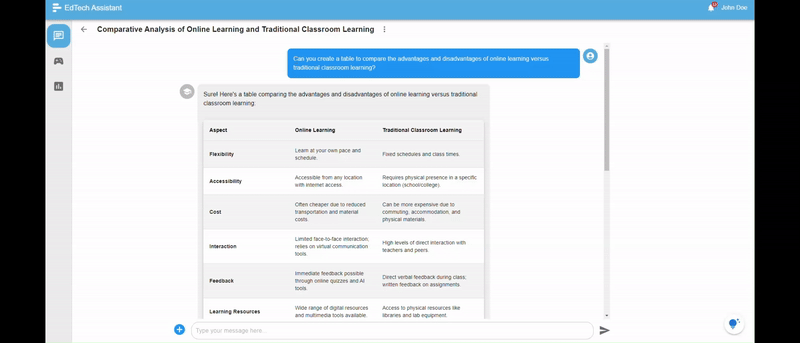 -->
<p align="center">
  
</p>

## Quiz

The quiz system provides exceptional flexibility, allowing users to customize quizzes and questions while choosing from various question types. Additionally, it offers the option to generate quizzes using our AI models, requiring only a few instructions (prompts) to automate the process and deliver exactly what users need efficiently.

### Create Quiz

You can create a new quiz by clicking the create quiz button and click edit button at the top to edit the name, and click the add question to add a new question

<p align="center">
  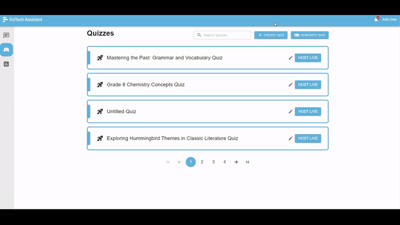
</p>

### Edit Question

You can edit the question text, modify the answers, and specify the correct ones. There are three types of questions to choose from: **Multiple Choice**, where only one correct answer is accepted with four possible options; **Multiple Answer**, where more than one correct answer can be specified; and **True/False**, which only allows two possible answers. Any changes made to a question require clicking **Save** to apply the updates or **Delete** to remove the question entirely. Additionally, when hovering over a question in the left panel for more than one second, a preview will appear, showing how the quiz will look during the game.

<p align="center">
  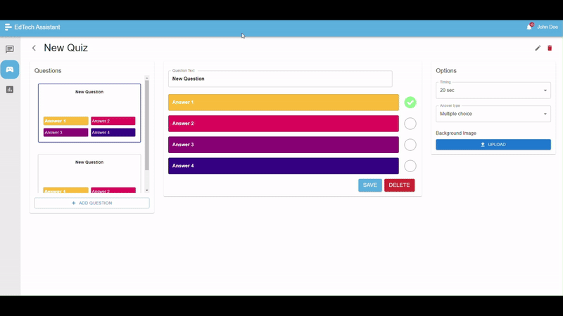
</p>

### Upload Image for Question

You can also upload an image for a question to enrich the content like this example and hover over a question to preview how it would look like while playing in game.

<p align="center">
  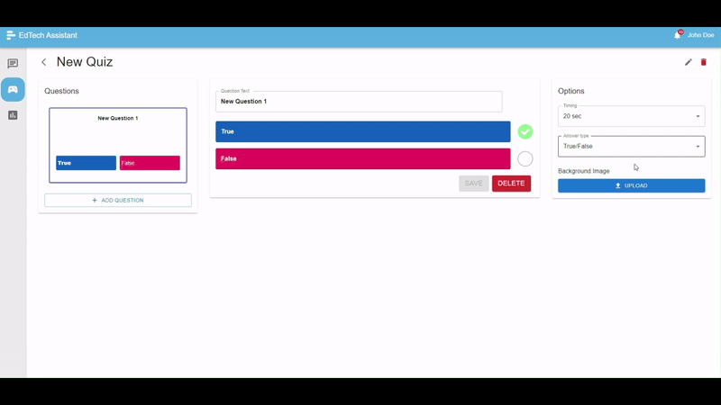
</p>

### Generate Quiz

Our application also supports automatic quiz generation based on user instructions, streamlining the quiz preparation process. Users can also specify the types of questions they want to include in the quiz.

<p align="center">
  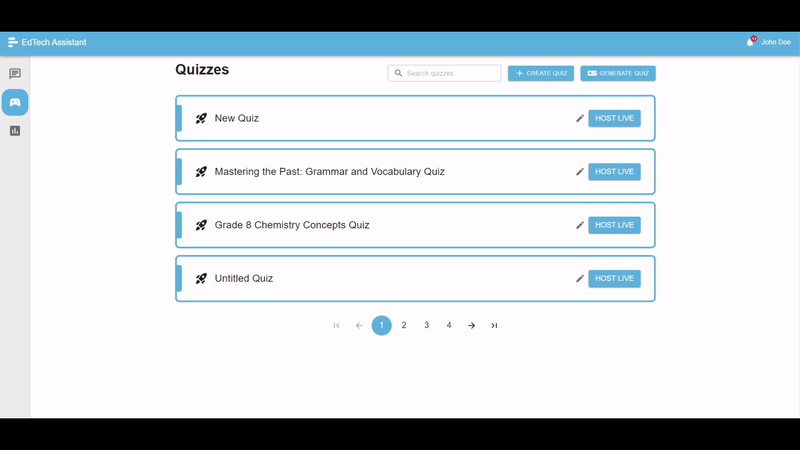
</p>

## Game

To host a quiz, simply click the "Host Live" button to start the quiz and play with students in real-time.

### Lobby Page for Teacher

<p align="center">
  
</p>

Lobby page for the teacher to wait for students to join

### Player Join

Students don't need an account to join the quiz. They can simply navigate to the home page, click "Join," and enter the game code along with their name to participate.

<p align="center">
  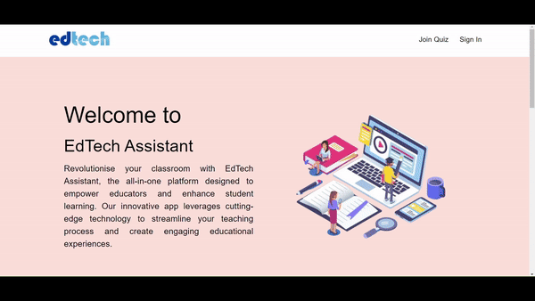
</p>

### Waiting Page

Once the teacher finalises the player list and starts the game, their screen will display the quiz name and the total number of questions included in the quiz.


### Waiting Page before each Question

Before each question, there is a 6-second waiting page to ensure that all players have received the question data. This buffer ensures that when the question begins, every player has an equal opportunity to answer without experiencing delays. This page also allows students to read the question first and prepare the answer first

<p align="center">
  
</p>

Ready Page for students:

<p align="center">
  
</p>

### Question Page

During the question page, the teacher can skip the question once at least one student has answered. After the question ends, the correct answer will be displayed, along with basic statistics such as the number of students who selected each answer.

<p align="center">
  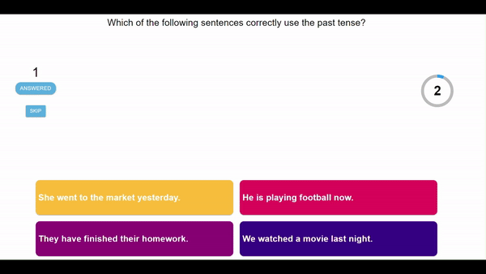
</p>

Students can answer questions, such as multiple-choice, by selecting their responses and submitting them. After submission, they will wait for the teacher to finalize the question, at which point the results will be displayed.

<p align="center">
  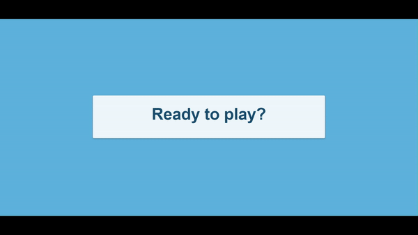
</p>

### Result Page

after the teacher clicks next button after finish each question, the current scoreboard will be presented

<p align="center">
  
</p>

Each student will be shown their earned score after answering a question. If they answer incorrectly, a separate screen will display indicating the incorrect response.

<p align="center">
  
</p>

### Final Scoreboard

After all the questions are completed, the teacher's screen will display a scoreboard showing the top 3 players.

<p align="center">
  
</p>

And each student will be presented with the score and rank in the game.

<p align="center">
  
</p>

## Notification

Our application includes a notification feature to alert users when long-running tasks are completed or special events occur. Notifications are stored in a list, categorised as read or unread. To mark a notification as read, users simply need to click on it.

<p align="center">
  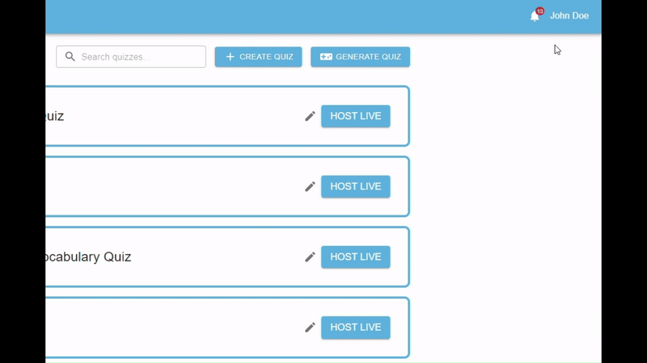
</p>

Example of notfication for long running tasks

<p align="center">
  
</p>

## Assignment

The assignment page is an exclusive feature available to select users, providing specialized information tailored to track student progress for specific assignments. To access this feature, please contact our admin, [Minh Nguyen](mailto:nganhminh2003@gmail.com) or [Hung Tran](mailto:hungtrangia2003@gmail.com), via email.

### Assigment List

when you first enter the page you will see a list of available assignments assigned to you account. you can also search for a specific assignment you want to look into.

<p align="center">
  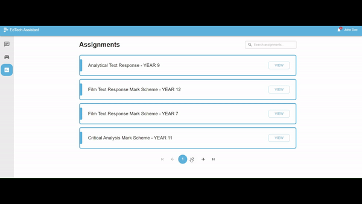
</p>

### Assignment Detail

When selecting an assignment, you will be presented with the assignment details, including the rubric and a list of classes associated with that assignment.

<p align="center">
  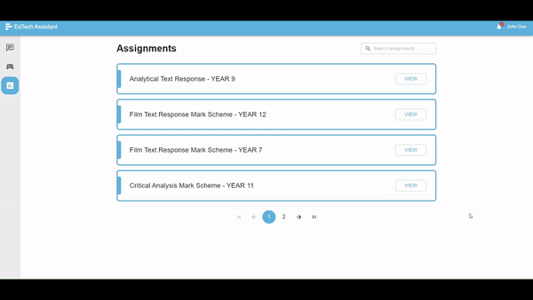
</p>

### Detail for a Class in an Assignment

After clicking "View" for a class in an assignment, you will be directed to a detailed page showing a list of extracted issues, generated lessons, and quizzes for that class. Upon entering the page, you can access rules and guidance for easier navigation by clicking the question mark button in the bottom-right corner.

<p align="center">
  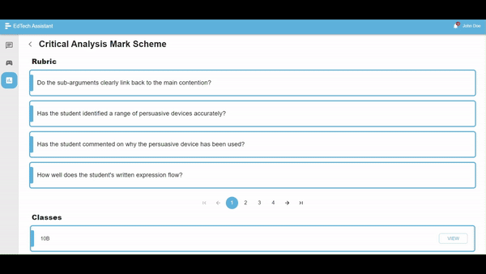
</p>

**Issue Extraction**

The application extracts common issues identified for the entire class in an assignment. However, the issue extraction function is not triggered automatically from students' work. Users must manually initiate this process when first entering the class page for an assignment. The automatic issue extraction feature can only be used if no issues have already been identified in the list.

<p align="center">
  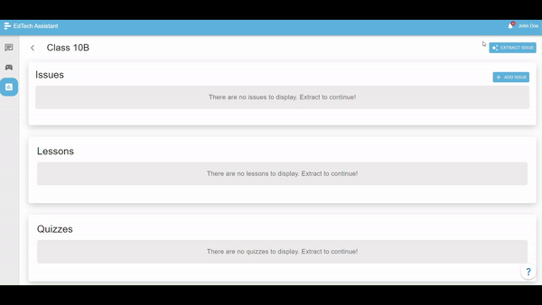
</p>

The extraction process can take up to 10 minutes. During this time, you can perform other tasks, and a notification will pop up when the process is complete, as shown in the example. If you choose to stay on the page, it will automatically load the issues once the process is finished, thanks to WebSocket, which receives real-time updates. Once you used the automatic issue extraction you can only re-use it after 2 hours.

**Issues Editing**

You can manually add or edit issues if needed. However, there is a limit of 10 issues that can be added.

<p align="center">
  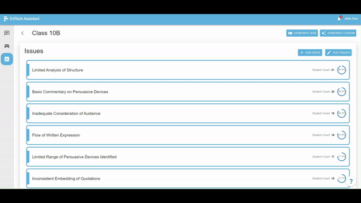
</p>

**Lesson Generating**

Lessons can only be generated if at least one issue has been identified. To generate a lesson, click the "Generate Lesson" button and specify the desired file name. Once the lesson is generated, you can download it to view the content.

<p align="center">
  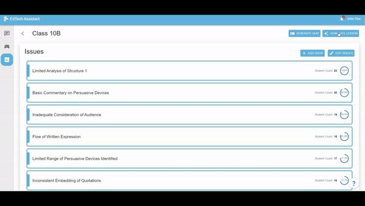
</p>

**Lesson Name Editing**

Once a lesson is generated, you can rename it as desired. There is a limit of five lessons per class in an assignment. If you wish to generate additional lessons, you will need to delete existing ones first.

<p align="center">
  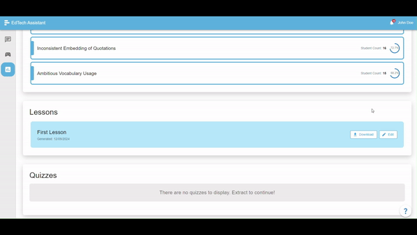
</p>

**Quiz Generate**

You can also generate quizzes to create interactive lessons based on the identified issues in the class. To do so, click the "Generate Quiz" button and select the types of questions you want to include. To edit a quiz, click the "Edit" button, which will navigate you to the quiz editing page, where you can modify the quiz as needed.

<p align="center">
  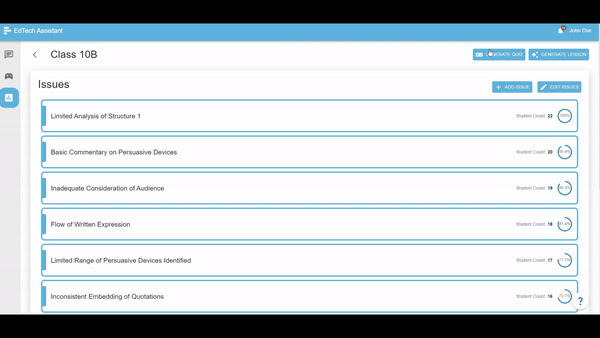
</p>

# Technical Overview

This section provides an in-depth look at the structure and components of the EdTech Assistant front-end project, focusing on how various contexts and providers interact to manage state and functionality across the application.

## Application Architecture

### Folder Structure

```bash
/src
|
├── /components
|
├── /context
|    ├── authContext.js
|    ├── historyContext.js
|    └── ...
|
├── /hoc
|    ├── withAuth.js
|    ├── withNonAuth.js
|    └── ...
|
├── /hooks
|    └── ...
|
├── /lib
|    ├── api.js
|
├── /pages
|    ├── _app.js
|    ├── _document.js
|    ├── /assignment
|    |    └── ...
|    ├── /quiz
|    |    └── ...
|    └── ...
|
├── /styles
|    └── globals.css
|
└── /theme
     └── palette.js

```

- **/components:** Modular UI elements that are reusable across different parts of the application.
- **/context:** Global state management using React Context API, allowing shared state and logic to be accessed across multiple components.
- **/hoc:** Higher-Order Components for handling authorisation and access control to specific pages.
- **/hooks:** Custom hooks encapsulate reusable logic, providing a clean way to manage state and side effects.
- **/lib:** Shared libraries and utility functions, including a custom Axios instance for API requests.
- **/pages:** Contains all the pages of the application, with subfolders for more complex routes (e.g., `/assignment`, `/quiz`). `_app.js` and `_document.js` handle global app settings and document structure.
- **/styles:** Global styling to ensure consistency across the UI.
- **/theme:** Centralised theme settings, particularly for color palettes, making it easy to maintain and update the application’s visual style.

### Routing and Navigation


- **/**: The root of the application. After login, users are redirected to the `/assistant` page. Once logged in, users cannot re-enter the root page and will be automatically navigated to the `/assistant` page.
- **/assistant**: The chat page where users interact with our state-of-the-art model. This is the primary interface after login, offering AI-powered assistance and interaction.
- **/auth**: Handles user authentication. This page ensures that only authorised users can access specific parts of the application.
- **/game**: A route dedicated to hosts for setting up and controlling a game session. Only authorised users can access this page.
- **/join**: A public route where players can join a game. This route does not require user authentication.
- **/lobby**: Used by hosts to manage the game session before it starts, including participant management and settings. This route is accessible only to authorised users.
- **/play**: Another public route for players to actively participate in the game or quiz. Similar to `/join`, it does not require authentication.
- **/assignment**: The base route for managing assignments. It includes:
  - **/[assignmentId]**: A dynamic route for accessing specific assignments.
  - **/[classAssignmentId]**: Within a specific assignment, this page displays the results of a class, including extracted issues and generated lessons and quizzes related to that assignment.
- **/quiz**: The base route for quizzes, with a dynamic sub-route for accessing specific quizzes (`/[quizId]`).
- **/404**: The custom 404 page for handling non-existent routes. This page ensures that users who try to access an invalid URL are shown an appropriate error message.

### Page Layout Structure

<p align="center">
  
</p>

- **AuthProvider**
  - Manages user authentication across the application.
- **HistoryProvider**
  - Handles navigation state, ensuring correct page transitions and functionality.
- **PlayerWebSocketProvider**
  - Maintains player-specific state across multiple pages for real-time interactions.
- **HostWebSocketProvider**
  - Manages game state and information for the host during game sessions.
- **getLayout(Component)**
  - Determines the layout for each component, allowing flexible page rendering.
- **Render Component**
  - The final step where the selected component is rendered within its layout.

### Component Layout Overview

<p align="center">
  
</p>

- **\_document.js**
  - Positioned at the top of the structure, `_document.js` is responsible for setting up the global HTML document structure, including SEO elements like meta tags and the `<head>` section of the page.
- **App Component**
  - The entry point of the application, the `App` component wraps around the entire application, managing global context and providing the foundation for routing and layout structure.
- **Page Component**
  - The `Page` component handles SEO and structured data for each individual page. It ensures that each page is optimised for search engines and social media by managing elements like the title, description, and open graph data.
- **Common Page Layout**
  - This component provides a consistent structure across all pages of the application. It includes key UI elements such as the `Top Bar`, `Main Content`, and `Side Bar`, ensuring a cohesive user experience.
- **Top Bar**
  - Part of the common layout, the `Top Bar` typically includes navigation elements, logo, or other global actions accessible throughout the application like logout.
- **Main Content**
  - This area is the core of the page, where the main content relevant to the current route is displayed. It adapts based on the specific page or route being accessed.
- **Side Bar**
  - Also part of the common layout, the `Side Bar` can contain additional navigation, tools, or contextual information that supports the main content.
- **Page-specific Layout**
  - Beneath the `Main Content`, the page-specific layout adjusts depending on the page, such as `/assignment`, `/quiz`, etc. Each route can introduce unique layout elements or additional components tailored to its content.

## Communication with the Backend

### With API

communication with the backend is facilitated through an instance of Axios, a popular HTTP client. This instance is configured to handle API calls efficiently and securely. Below is an example that illustrates how the API instance is used to manage the login process.


The graph illustrates how the login process is handled in the application. The user submits their credentials, which are sent to the backend via an Axios instance. Upon successful authentication, tokens are stored in cookies and the user's authentication state is updated, allowing them to access the chat page.

### The use of Axios interceptor

In order to properly handle refresh token, and by doing this I can avoid repeating code for every HTTP call and interceptors can detect when an authentication token has expired. Before allowing a failed request to cause an error in the application, an interceptor can attempt to refresh the token and try the original request automatically.


This diagram illustrates a simplified version of the token refresh process in the EdTech Assistant application, specifically designed to handle authorisation for API requests. When an authorised request is made, the system first checks if the current access token is expired. To prevent issues during long-running requests, the expiration time of the access token is manually set to expire 30 minutes earlier than the original one-day expiration. If the token is expired, the system sends a refresh request to the backend, which returns a new access token. This new token is then stored in cookies, and the original request is retried with the updated token, ensuring continuous and secure access to the application’s features without interruption.

### With WebSocket

WebSocket is primarily used for two tasks: real-time notifications and game interaction. It ensures real-time updates and provides better response times for game hosting. The WebSocket connection is managed using `socket.io-client` and is implemented as a global context. This approach maintains consistent information across different pages, ensuring the correct logic is applied with the same socket instance throughout the game.


This diagram illustrates how a global WebSocket connection is managed across different pages using a **HostWebSocketProvider**. The provider initializes or reuses a WebSocket instance, registers necessary event listeners, and stores the instance in a **global WebSocket context**. Components throughout the app can then access this shared WebSocket instance through the context to send and receive real-time events, ensuring consistent communication across pages.
