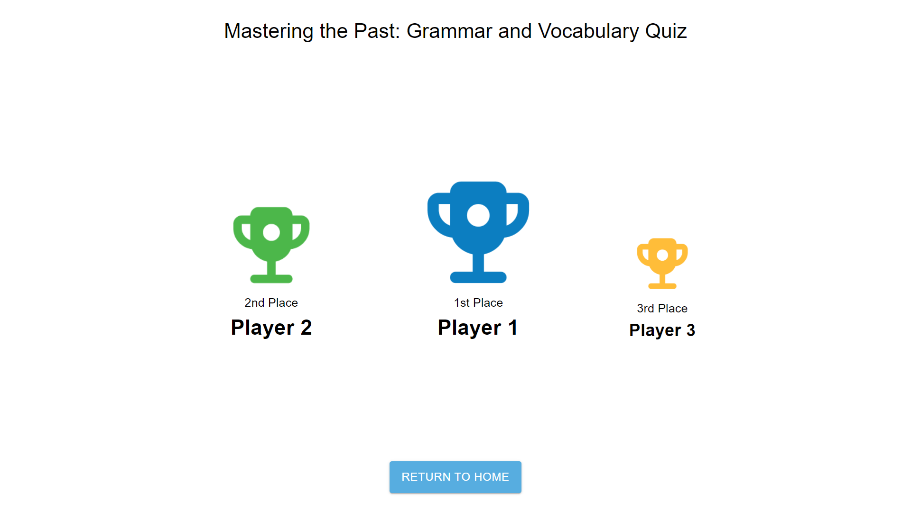

# Real-Time Multiplayer Game Supporting Up to 200 Concurrent Players

Our **real-time multiplayer game** is built to support up to **200 players** simultaneously, offering a seamless and immersive experience for both teachers and students. With its cutting-edge features, this platform is **transforming the educational landscape** by turning learning into a dynamic, competitive game.

## Table of Contents

1. [Overall Process for Teachers](#overall-process-for-teachers)
2. [Overall Process for Students](#overall-process-for-students)
3. [Initiating a Game with Multiple Players – Teacher View](#initiating-a-game-with-multiple-players--teacher-view)
4. [Joining a Game – Player View](#joining-a-game--player-view)
5. [Real-Time Question Updates for Teachers](#real-time-question-updates-for-teachers)
6. [Real-Time Engagement for Students](#real-time-engagement-for-students)
7. [In-Question Process Flow for Teachers](#in-question-process-flow-for-teachers)
8. [Final Scoreboard – Teacher View](#final-scoreboard--teacher-view)
9. [Final Scoreboard – Player View](#final-scoreboard--player-view)
10. [Different Types of Questions for Players](#different-types-of-questions-for-players)

## Overall Process for Teachers

Teachers have full control over the game’s flow, overseeing the entire process from game setup to final scoring, ensuring that every learning objective is met.

## Overall Process for Students

Students enjoy a **fast-paced, interactive** experience, engaging with their peers in real time, pushing their knowledge to the limit!

## Initiating a Game with Multiple Players – Teacher View

Teachers can easily initiate games with **multiple players**, setting the stage for real-time competition where students join with excitement.

## Joining a Game – Player View

Players jump into the game, ready to compete, answering questions and **challenging each other** in a fun, educational environment.

## Real-Time Question Updates for Teachers

As the game progresses, teachers receive **real-time question updates**, monitoring the players' performance and engagement effortlessly.

## Real-Time Engagement for Students

Players are continuously engaged with **live questions**, pushing their speed and knowledge as they aim for the top score.

## In-Question Process Flow for Teachers

Teachers can follow the **in-question process** with ease, overseeing how students respond to questions, guiding the flow of the game.

Players tackle each question in real time, competing against their peers to see who can answer the fastest and most accurately.

## Final Scoreboard – Teacher View

At the end of the game, teachers see the **final scoreboard**, revealing the top performers and providing insights into how each student performed.

## Final Scoreboard – Player View

Players proudly view the **final scoreboard**, celebrating their achievements or reflecting on how to improve next time.

---

### Additional View: Different Types of Questions for Players

The game features **a wide variety of question types**, designed to challenge players' knowledge and critical thinking, making each session both fun and educational.

---

This platform is designed to be **the ultimate tool for teachers and students**, delivering a real-time, multiplayer learning experience that is both **educational and engaging**. Whether you’re a teacher guiding students or a player competing with peers, this game provides a thrilling and educational challenge like no other!
