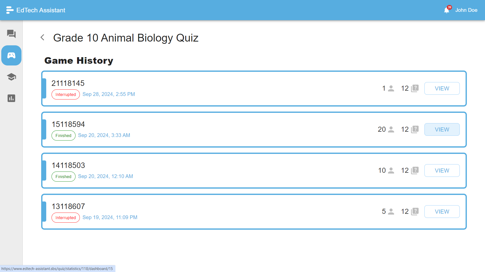
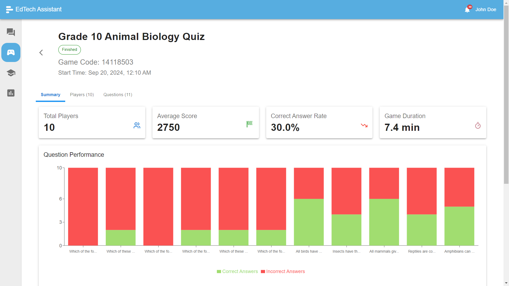
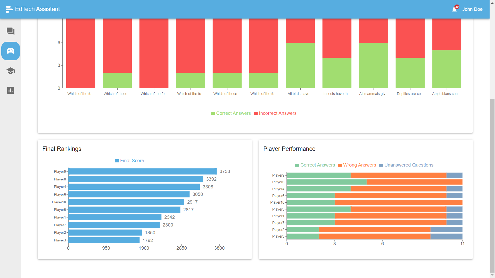
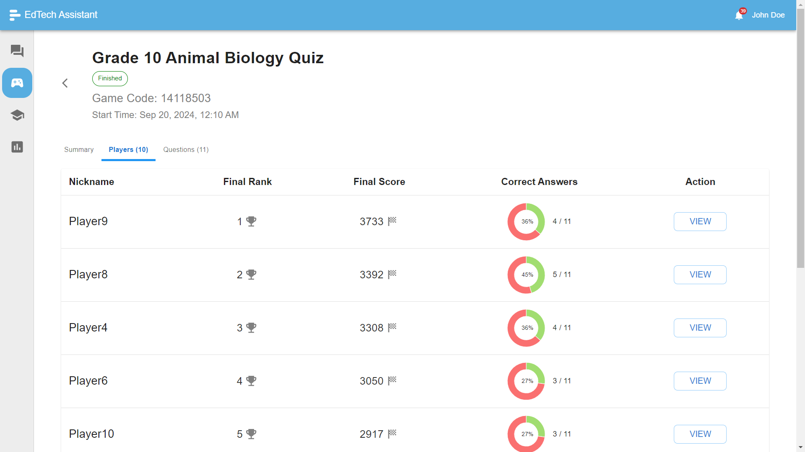
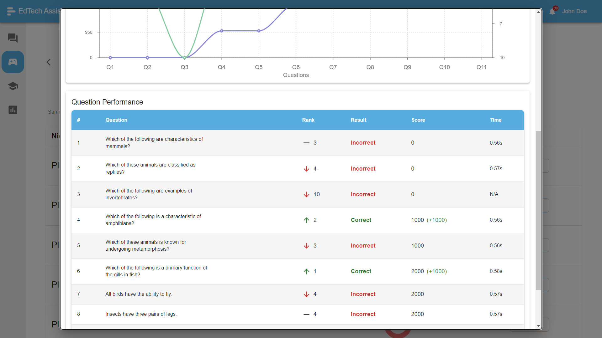
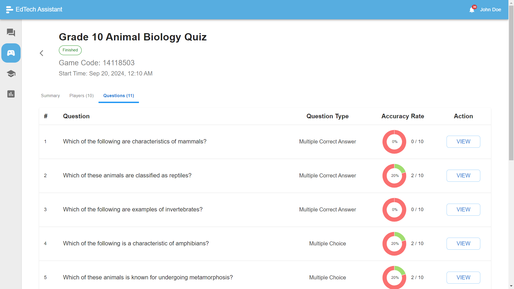
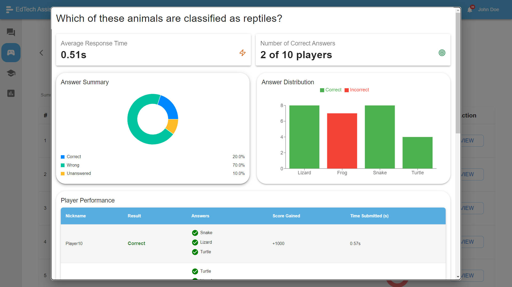
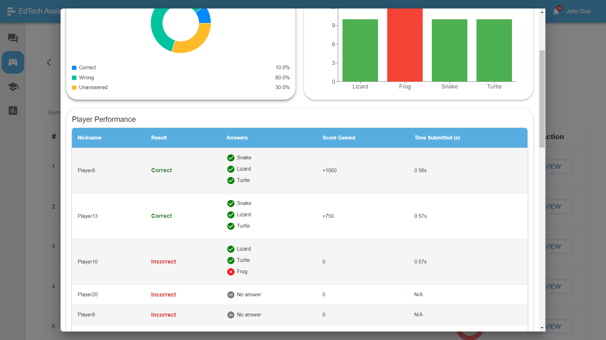

# Game Dashboard for Performance Insights and Analytics

Introducing the **Game Dashboard** — a powerful tool that provides **in-depth performance insights** and analytics for both teachers and players! This dashboard is designed to **transform data into actionable insights**, helping you monitor and improve game-based learning experiences effortlessly.

## Table of Contents

1. [Dashboard Overview](#dashboard-overview)
2. [Summary of a Game](#summary-of-a-game)
3. [Statistics for Individual Players](#statistics-for-individual-players)
4. [Statistics for Questions](#statistics-for-questions)

## Dashboard Overview

## Summary of a Game

## Statistics for Individual Players

## Statistics for Questions

The **Game Dashboard** offers a **comprehensive overview** of player performance, game metrics, and real-time analytics. It’s your go-to control center for understanding how students engage with content and how well they perform in competitive learning environments.

With **real-time data** at your fingertips, you can track:

- **Player participation** and engagement levels
- **Accuracy and speed** of responses
- **Overall game results** for instant analysis

This dashboard empowers educators to make **data-driven decisions**, refining lesson plans and improving student learning outcomes with a single glance!

---

The **Game Dashboard** is a revolutionary tool that turns raw data into **dynamic visual insights**—putting you in the driver’s seat of your classroom’s game-based learning journey. Whether you’re looking to understand individual student progress or overall class trends, this dashboard delivers **crystal-clear analytics** to help you achieve better educational outcomes!
