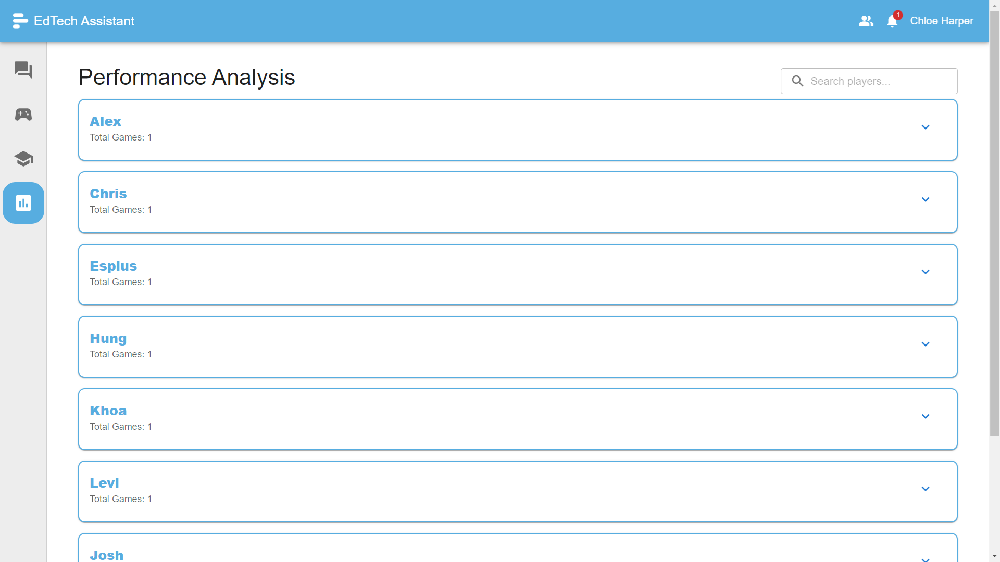
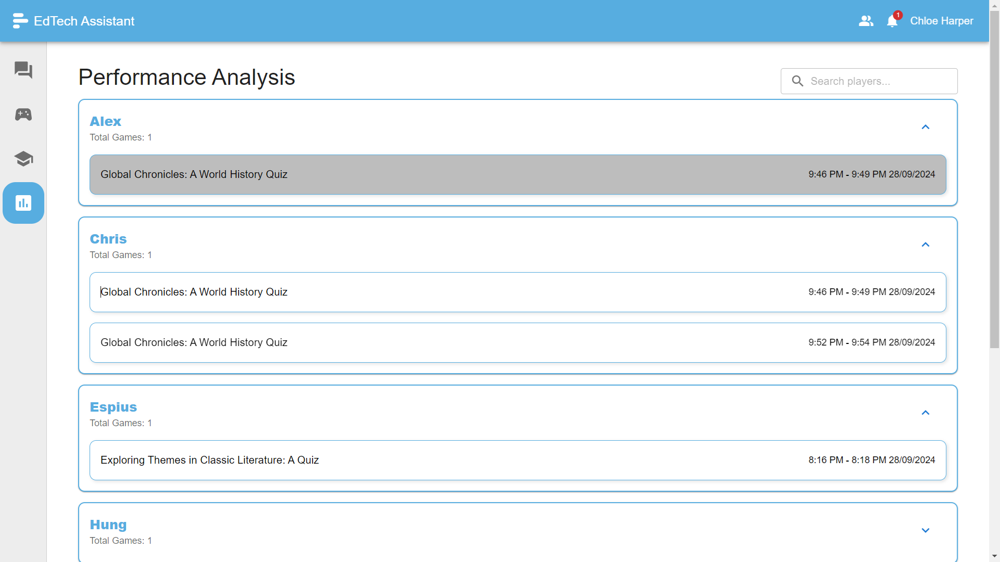
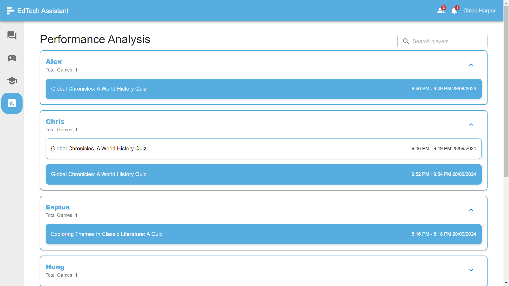
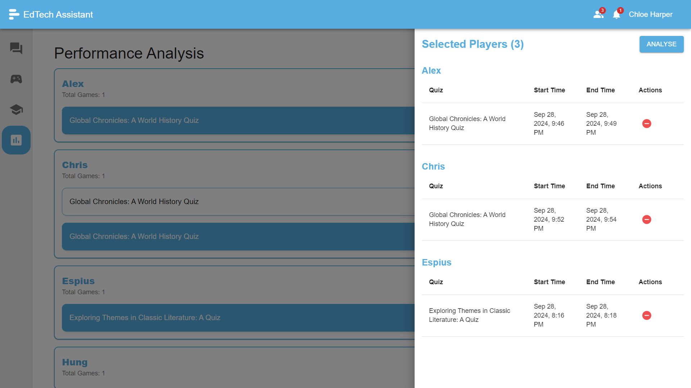
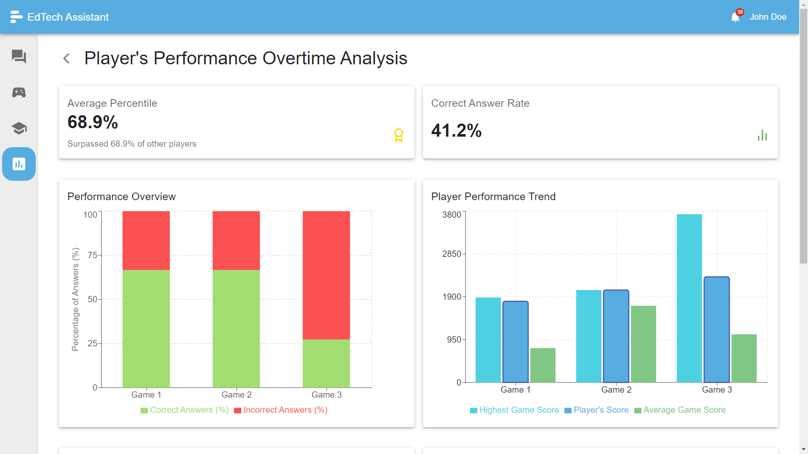
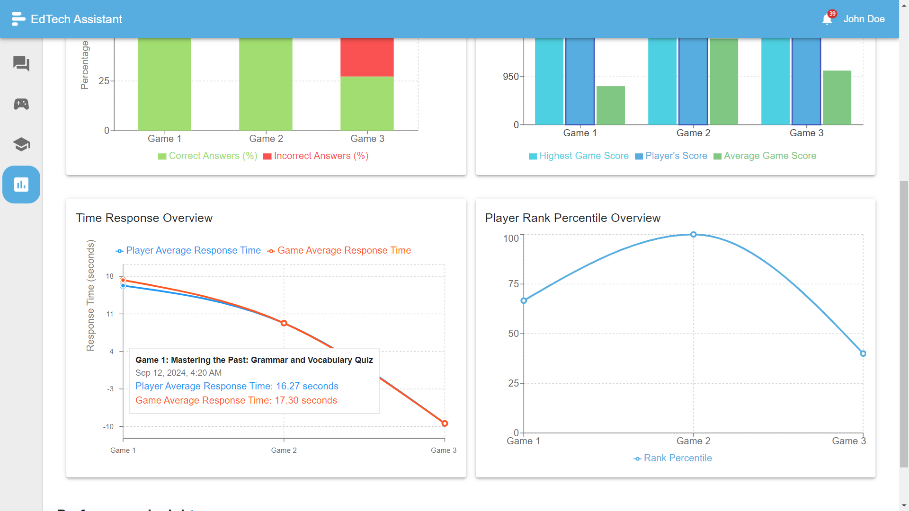
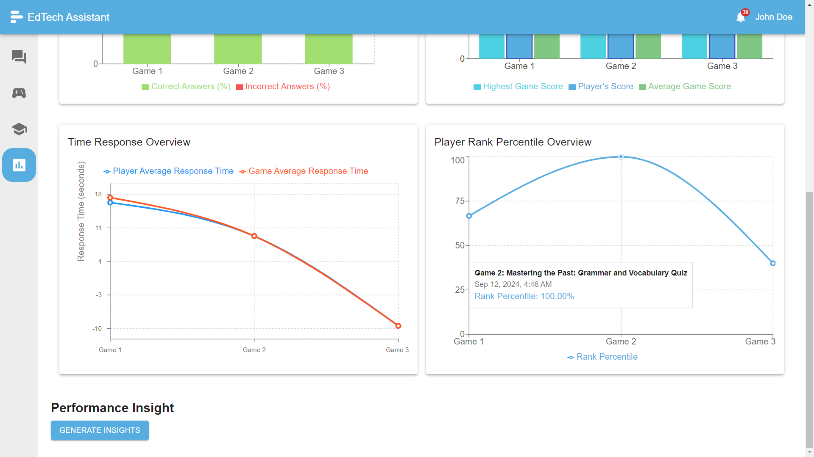
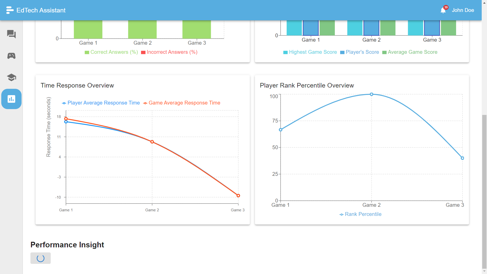
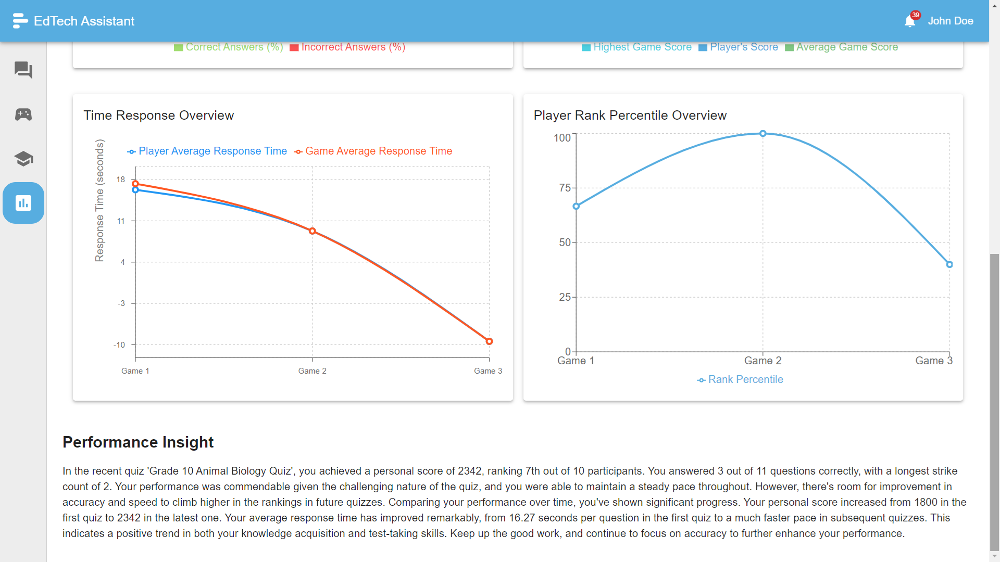

# Player Performance Analysis Over Time

Unlock the true potential of **performance tracking** with our cutting-edge **Player Performance Analysis** feature! Tailored for educators, this tool provides **comprehensive insights** into student performance trends over time, making it easier than ever to **identify progress gaps**, optimize strategies, and **boost learning outcomes**.

## Table of Contents

1. [Player Performance Analysis Dashboard](#player-performance-analysis-dashboard)
2. [Identify the Student That Needs to Be Analyzed](#identify-the-student-that-needs-to-be-analyzed)
3. [View Performance of the Chosen Student](#view-performance-of-the-chosen-student)
4. [Automatically Get Insights Using Powerful LLMs (Large Language Models)](#automatically-get-insights-using-powerful-llms-large-language-models)

## Player Performance Analysis Dashboard

Dive into the **performance dashboard**, where both teachers and students gain access to real-time data that highlights performance trends and overall progress.

## Identify the Student That Needs to Be Analyzed

Teachers can effortlessly select the **students that require focus**, analyzing their individual performance data for actionable insights.

## View Performance of the Chosen Student

Once a student is selected, educators can review their **detailed performance metrics**—including speed, accuracy, and participation—across various sessions, identifying areas of strength and opportunities for growth.

## Automatically Get Insights Using Powerful LLMs (Large Language Models)

Harness the power of **advanced AI and LLMs** to automatically generate insights and recommendations based on player performance. This feature helps educators make **data-driven decisions** with minimal effort, offering tailored suggestions for future improvement.

Key highlights include:

- **Targeted student analysis** for in-depth performance tracking
- Comprehensive views of **individual and class-wide progress**
- **Automated insights** powered by LLM technology
- **Visual performance summaries** to quickly identify trends and patterns
- **Easy-to-use interface** for teachers to monitor and support students in real time

This tool transforms **raw performance data** into clear, actionable insights, empowering educators to **personalize learning** for every student.

---

The **Player Performance Analysis** feature is an invaluable asset for teachers and students alike. By offering real-time data, powerful AI-driven insights, and detailed performance metrics, it helps foster **continuous improvement** in educational game-based learning. Whether tracking a single student's progress or analyzing class-wide trends, this feature is the key to unlocking better learning outcomes.
